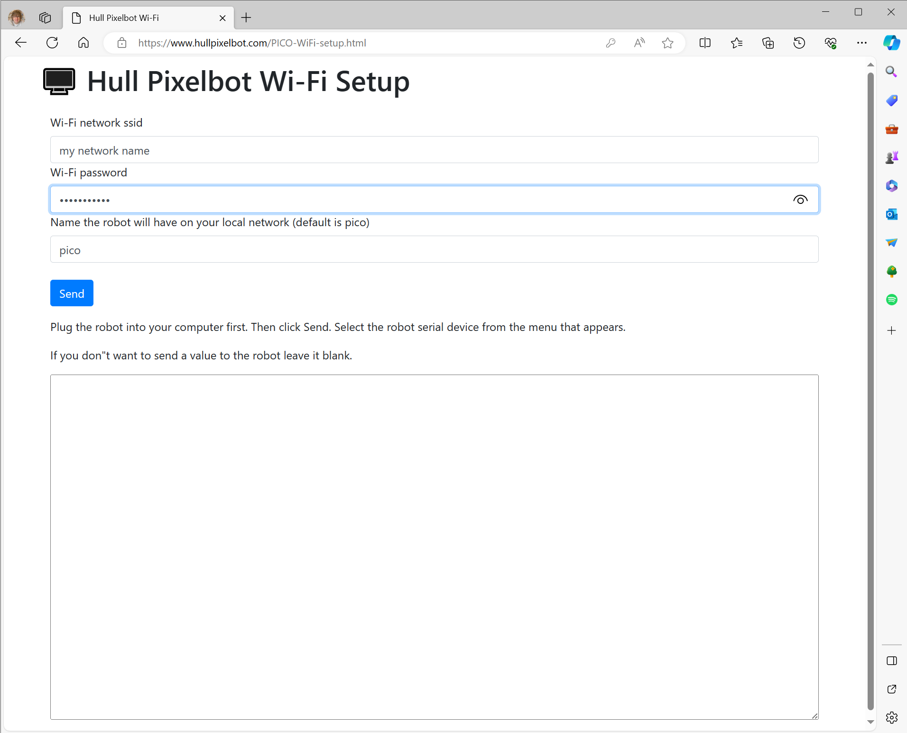

# PICO Hull Pixelbot 

This is the Raspberry Pi PICO version of the Hull Pixelbot. It can also be built for an ESP32 (although at present this is a work in progress). The control software is called HullOS. 

* You can find the Arduino Uno version of the pixelbot [here](https://github.com/HullPixelbot/HullOS). 

* You can find all the Hull Pixelbot repositories on GitHub [here](http://hullpixelbot.com/). 

* You can get the documentation for Python-is (the language used to program the Pixelbot) [here](https://www.hullpixelbot.com/HullOS%20Python-ish%20Specification.pdf),

* You can get the 3D printable and laser cut chassis designs [here](https://github.com/HullPixelbot/Hardware).

* You can find the code for the Connected Little Boxes device which can provide network connectiivty to an Arduino powered Pixelbot [here](https://github.com/connected-little-boxes/HULLOS-X)

## Putting HullOS on a PICO or PICO-W
You can load HullOS onto a Raspberry Pi PICO or PICO-W by:

1. Download the image file from [PICO](PICO-HULLOSR1-3.uf2) or here [PICO-W](PICOW-HULLOSR1-3.uf2) and store it on your computer. 
1. Hold down the BOOTSEL button on your PICO. 
1. Plug the PICO into your PC.
1. Release the BOOTSEL button.
1. An external drive will open on your computer. 
1. Drag the image file onto the drive.
1. The PICO will reboot running HullOS

## Connecting to HullOS
You can communicate with HullOS via any terminal program. The baud rate is set to 115200. HullOS will not echo commands as you type them. Press the enter key at the end of each command. The command "*IV" can be used to test a connection, it returns the version number of the software:
```
*IV
HullOS R1.3
```
## Local editing Python-ish programs
You can program the robot using Python-ish. You can do this using an on-line editor you can find [here](https://www.hullpixelbot.com/Python-ish.html). This works with either the PICO or PICO-W. You plug the robot into your PC using a serial cable and then connect to the robot from the web page. 
## Remote editing Python-ish programs
If your robot is powered by a PICO-W you can connect it to your local Wi-Fi and edit programs directly on the robot. It hosts a tiny web site containing the program editor. Note that before you do this you need to plug your robot into a computer and configure the network settings and the name your robot will have on your local network. You can find the configuration page [here](https://www.hullpixelbot.com/PICO-WiFi-setup.html)

## PICO-W Pixelbot and Wi-Fi
When you turn on a PICO-W pixelbot running the PICO-W version of the software the robot will try to connect to the local Wi-Fi. While it is connecting it will display a rotating magenta display on the pixels. When the robot connects successfully this display goes off and the robot runs the most recently loaded Python-is program. If the robot fails to connect to Wi-Fi it will display a rotating red display for a few seconds and then run the most recently loaded program. If you see the red display you should connect your robot to your PC and configure the Wi-Fi correctly. You can always use a serial connection to edit programs in the robot, whether it is connected to Wi-Fi or not.



Plug your robot into your PC, browser to the web page, enter your settings and then press Send to send them into the robot. You only need to do this once, when you first get the robot. Note that this only works if your robot is powered by a PICO-W. When you have set up your robot you should be able to browse to the robot on your local network. The address of your robot will have the format:
```
http:\\pico.local
```
If you have multiple robots you want to control you can give each a different name.

## Battery power
The robot can be powered using 3 or 4 AA sized cells. If you use 4 cells you should make sure that the battery voltage does not exceed 6.5 volts (some batteries give out more than 1.5 volts when brand new) otherwise the PICO may not run. If you use rechargeable batteries you can use 4 with no problem as each battery only produces 1.2 volts. 
## Building the hardware

You can build the circuit on a breadboard as shown above. The signal pins for the devices connected to the robot are as follows. If you want to change these they are set in the respective ".h" files for the different devices.

| Signal | PICO GPIO | ESP32 GPIO |
|--------|-----------|------------|
| Distance trigger | 17  | xx |
| Distance Echo | 16 | xx |
| Left motor 1| 15| 13 |
| Left motor 2| 14| 12 |
| Left motor 3| 13| 14 |
| Left motor 4| 12| 27 |
| Right motor 1| 11| 26 |
| Right motor 2| 10| 25 |
| Right motor 3| 9| 33 |
| Right motor 4| 8| 32 |
| Neopixel | 6 | 21 |

## Building the HullOS software
The HullOS software is built using Platform.IO. You can edit the platformio.ini file in the repository to select the build version and deployment. At present the PICO code is deployed to the PICO debugger. You only need to do this if you want to change the assignment of the GPIO pins or add/change features or deploy to the ESP32 platform. There are two program source folders, one for PICO and the other for PICO-W. 

## Web pages
The edit page and the configuration page are in the Web Pages folder. This folder also contains the serial driver code used to communicate with the robot. 

Have fun

Rob Miles