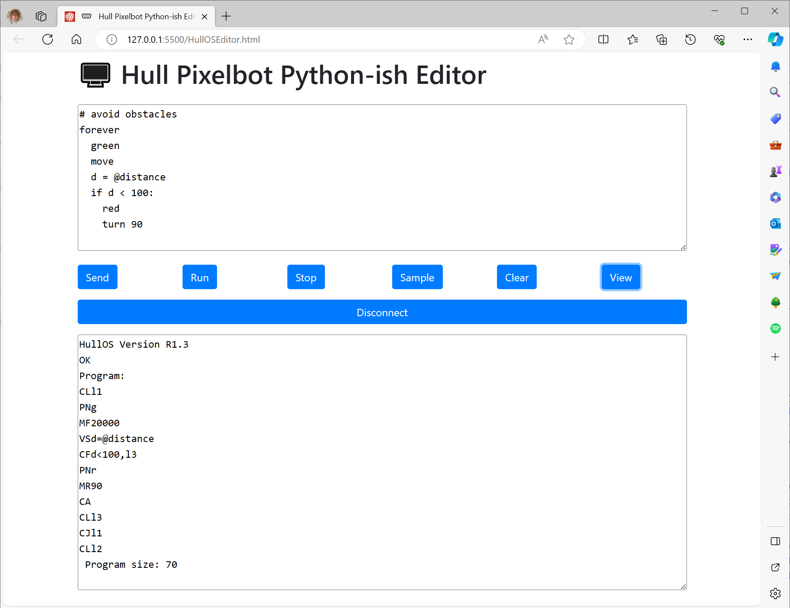

# Python-ish Web SerialEditor

A web based editor that lets you edit and deploy Python-ish programs via a serial connection to your robot.
## Installation
You can install the files on a computer, or you can use the on-line version you can find [here](http://hullpixelbot.com/Python-ish).
## Getting started
To get started just plug your Hull Pixelbot into a serial port on your machine. Then press the Connect button. You will be asked to select a serial port. If there is more than one, try the one that has PICO in the name. Otherwise you'll have to work through them, or unplug the robot, try to connect, plug the robot back in and connect to the serial port that has just appeared. After you have connected the robot version should appear in the output window at the bottom of the page and the button changes to "Disconnected".

Enter your program into the editing window at the top and press *Send* to send it to the robot. Press *Run* to run it and *Stop* to stop it. There are some sample programs you can load by clicking *Sample*. The *Clear* button clears the program in the robot's storage and the *View* button lets you see the compiled low-level code in the output window.

When you have finished just remove unplug the robot. 
You can find a description of the Python-ish language [here](https://github.com/HullPixelbot/Documentation)
## Wi-Fi configuration
There is also a 

##  Errors
If the robot doesn't like one of your Python-ish statements you will see an error number with a line number on it in the output window. There are error descriptions in the langauge document.

Have Fun

Rob Miles